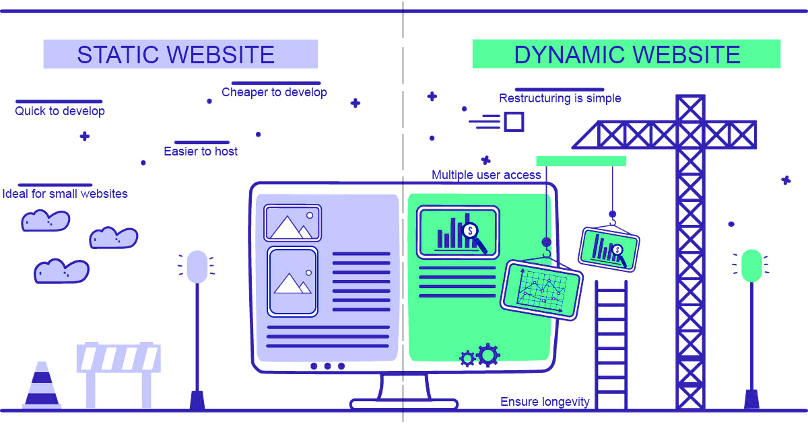
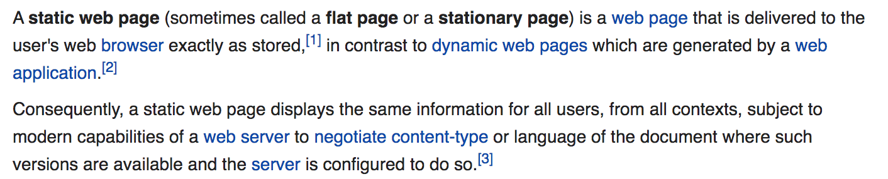

# Static Sites

This workshop is intended to give a broad overview to static sites, what they are, why and when to use one, and the many different flavors for building them.

## What is a Static Site?

[From Wikipedia](https://en.wikipedia.org/wiki/Static_web_page)

Static sites are usually defined by what they aren't - namely web applications. This definition can be a bit confusing though because static sites still need to be hosted by a server and are written in programming languages that you might use to build web apps. Even more confusing is that you can still have dynamic, user interactive content on a static site through JavaScript.

So is there actually any difference between static sites and dynamic web apps?

While increasingly the two overlap, one of the main differences remains that static sites do not have live databases. You might still have data on a static site (a JSON file for example) but this data gets loaded with the website, not after the fact.

## Why are static sites so popular? What are the tradeoffs?

[How (and Why) to Generate a Static Website Using Jekyll, Part 1 by Alex Gil, 2015](https://www.chronicle.com/blogs/profhacker/jekyll1/60913)

Outlines some of the main benefits of Static Sites in 2015:

- Does not require security patches and are not vulnerable to being hacked like a Wordpress site

- Requires less maintenance and has a lower carbon footprint
  
- Loads faster than dynamically generated web pages

- Allows you to customize your website

*Are these still the benefits in 2019?*

Yes and no.

You'll still need to deal with outdated package dependencies with vulnerabilities and web server hosting for the static site, which can be vulnerable to security breaches.

Static sites might be less work than a web application, but they do require more technical maintenance than a Wordpress site.

Static sites can have a lower carbon footprint, but measuring carbon footprint for websites can be tricky. A static site might load faster, but at might be slow to load when you're building the site depending on the generator you choose.

Where they shine imho?

- Version control (if you use git)
- No clunky CMS (get to edit content directly)
- Portability (you can easily take your content with you)

Overall, recommend if you have:

- an interest in coding
- want to customize your website
- care about minimizing the size of your website and controling what infrastructure it relies on

If you just want to blog or have a CV online, might want to try a free Wordpress or Tumblr site before making the investment in a static site.

## How does a static site actually work?

A google search for static site generators returns millions of medium and quora debates over which is the best to choose, but few actually delve into the mechanics.

At it's core a static site generator takes some form of plain text file and transforms it into html files. These generator libraries will also let you style your website using a combinator of layouts, modular html, style sheets, and javascript.

## Github and Static Sites

[Configuring a custom domain with Github Pages and a static site](https://help.github.com/en/github/working-with-github-pages/configuring-a-custom-domain-for-your-github-pages-site)

[List of top static site generators](https://www.staticgen.com/) and [curated list of static site resources](https://github.com/myles/awesome-static-generators)

1. Jekyll and Ruby

- [Jekyll style guide](https://ben.balter.com/jekyll-style-guide/)

- [Setting up a GitHub Pages site with Jekyll](https://help.github.com/en/github/working-with-github-pages/setting-up-a-github-pages-site-with-jekyll)

- [Jekyll’s documentation on migrating existing websites](https://import.jekyllrb.com/docs/home/)
- [Ben Balter’s WordPress plugin for exporting data from WordPress into Jekyll](https://wordpress.org/plugins/jekyll-exporter/)
- [Exitwp, a Python script developed by Thomas Frössman](https://github.com/thomasf/exitwp)

1. Pelican and Python
2. Gatsby and React
3. Hugo and Go

